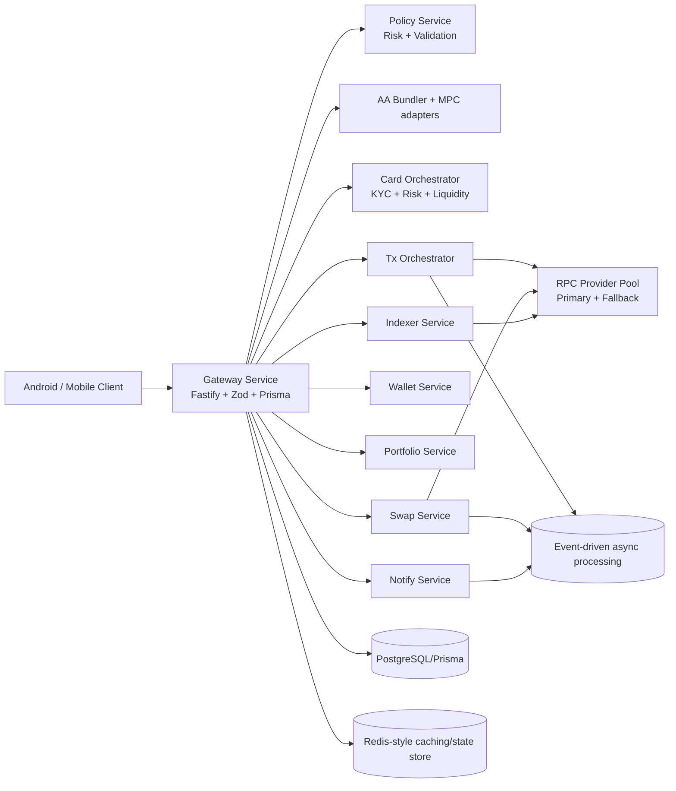

# zWallet Architecture (Repository-Aligned)

This document reflects the architecture currently implemented in this repository as of **May 4, 2026**.

## 1) System Goals

- Non-custodial wallet flows where signing stays client-side or in MPC boundaries.
- Deterministic, policy-controlled transaction orchestration.
- Swap routing with simulation and slippage protections.
- Card/fiat orchestration with KYC, risk, and liquidity checks.
- Multi-service deployment with Docker/Kubernetes/Terraform support.

## 2) Monorepo Topology

- `apps/` → user/API entrypoint apps (`apps/android`, `apps/api`).
- `android-app/` and `mobile/` → additional mobile client surfaces (native Android + React Native shell).
- `backend/services/` → production-style Node/TypeScript microservices (gateway, tx-orchestrator, swap-service, policy-service, notify-service, wallet-service, portfolio-service, indexer-service).
- `services/` → lightweight service implementations (`wallet-engine`, `swap-engine`, `indexer`, `router`).
- `packages/` + `backend/packages/` → shared crypto/types/chain and engine libraries.
- `api/` → Python FastAPI service variant with domain/application/infrastructure layering.
- `infra/`, `k8s/`, `terraform/` → container/runtime/deployment infrastructure.
- `docs/` → execution contract, security model, testing, and requirements.

## 3) Runtime Architecture (Primary Node Path)

## 4) Key Components and Boundaries

### 4.1 Client and signing boundary
- Android codebase includes keystore-backed security controls and wallet presentation flows.
- The trust boundary is explicit: private keys must not be exposed to backend orchestration layers.

### 4.2 Gateway (backend/services/gateway)
- Acts as the edge/API composition service.
- Enforces request validation/security plugins.
- Coordinates policy, card, liquidity, risk, AA bundler, and MPC adapters.
- Includes RPC provider pool logic and integration/e2e/unit tests.

### 4.3 Transaction orchestration
- `backend/services/tx-orchestrator` and gateway transaction modules implement lifecycle control.
- Expected transaction pipeline:
  1. Input validation
  2. Simulation/dry-run
  3. Gas estimation
  4. Nonce management
  5. Signing (client/MPC boundary)
  6. Broadcast through trusted RPC set
  7. Confirmation tracking

### 4.4 Swap architecture
- Swap capabilities exist in `backend/services/swap-service` and `services/swap-engine`.
- Design intent enforces route comparison, gas-aware scoring, and slippage controls.
- Scripts and tests cover swap execution and orchestration behavior.

### 4.5 Indexing/event processing
- Indexing services appear in both `backend/services/indexer-service` and `services/indexer`.
- Async/event flows are designed to be idempotent and retry-safe.
- State/store components exist for chain progress tracking.

### 4.6 API variants
- `apps/api` (TypeScript) and `api/` (Python FastAPI) represent alternative API stack paths.
- Python service follows layered architecture: `domain` → `application` → `infrastructure` → `interfaces`.

## 5) Data and Infra Planes

- **State and persistence**: Prisma schema in gateway service, SQL schema for indexer service, and repository abstractions in Python API.
- **Infra assets**:
  - Dockerfiles per service and top-level `docker-compose.yml`.
  - Kubernetes base + blue/green overlays and monitoring/logging manifests.
  - Terraform modules for AWS and GCP.
- **Observability direction**: Prometheus and ELK/monitoring manifests under `k8s/`.

## 6) Security and Reliability Controls (Repo Policy)

Implemented/documented controls across code + docs include:
- Strict validation (Zod/typed schemas).
- Rate limiting and request hardening.
- Multi-RPC/fallback routing (no single-endpoint dependence).
- Idempotent financial/event processing requirements.
- KYC/risk/liquidity gating for card-related flows.
- Security testing for attack paths and invalid/replay behavior.

## 7) Testing and Quality Gates

The repository includes:
- Unit, integration, e2e, and security tests (notably under `backend/services/gateway/test`).
- Service-level scripts for tx lifecycle and swap execution validation.
- Python API tests under `api/tests`.

A change should be considered done only when changed-scope checks pass and security constraints remain satisfied.

## 8) Practical Notes

- This repo currently contains **parallel implementations** (Node microservices, lightweight services, and a Python API). Treat `backend/services/gateway` + associated backend services as the most complete orchestration slice.
- Keep changes minimal and scoped; enforce security > correctness > performance > speed where trade-offs exist.
