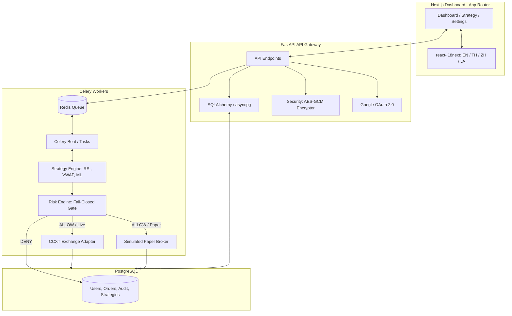
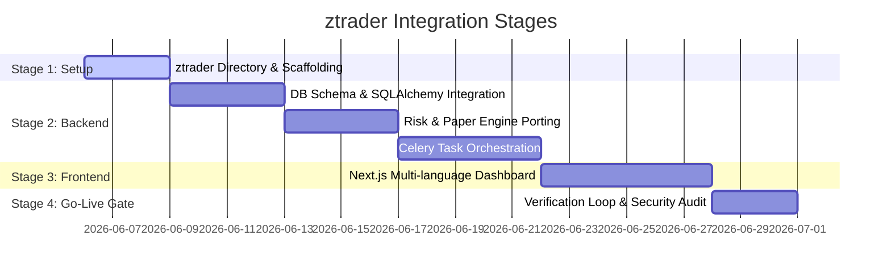

# ztrader Merge Architecture & Design Specification

This document defines the architecture and design for merging **ABTPi18n** and **zkbtrader** into a single, unified, production-grade application named **ztrader** under `apps/ztrader`.

---

## 1. Executive Summary & Context

The repository contains two trading applications representing different design focuses:
1. **ABTPi18n**: A full-featured Next.js frontend with multi-language (i18n) support, a FastAPI backend, PostgreSQL/Prisma database, Celery worker orchestration, and live CCXT-based exchange integrations.
2. **zkbtrader**: A safety-first crypto research and paper-trading scaffold using a fail-closed risk validation engine, default paper execution mode, and a server-rendered HTML dashboard.

### The Merge Objective: `ztrader`
By merging these codebases, **ztrader** combines the rich, localized UI and scalable Celery task loop of `ABTPi18n` with the safety-first defaults, fail-closed risk engine, paper broker, and audit logs of `zkbtrader`. The result is a premium, multi-language, safety-first algorithmic trading platform.

---

## 2. Core Architectural Principles

- **Safety-First Defaults**:
  - `EXECUTION_MODE` is strictly set to `paper` by default.
  - `LIVE_TRADING_ENABLED` defaults to `false` and can only be enabled via explicit user action and DB configuration.
  - A global `KILL_SWITCH` is implemented to pause all strategy executions instantly.
- **Fail-Closed Risk Gate**:
  - Every trade intent generated by a strategy *must* pass through a dedicated `RiskEngine` before executing (live or paper). If validation fails, the intent is denied and audited.
- **Unified Datastore**:
  - PostgreSQL with SQLAlchemy and asyncpg is the primary database.
  - The schema incorporates users, rental contracts, exchange credentials (AES-encrypted), strategy states, orders (simulated and live), and system audit logs.
- **Multi-Language (i18n)**:
  - Frontend supports English (EN), Thai (TH), Chinese (ZH), and Japanese (JA).

---

## 3. High-Level Architecture



---

## 4. Directory Structure of `apps/ztrader`

The merged application will live in `apps/ztrader` with clear separations:

```text
apps/ztrader/
├── backend/                   # FastAPI backend application
│   ├── db/                    # PostgreSQL migrations and connection pool
│   ├── src/
│   │   └── ztrader/
│   │       ├── __init__.py
│   │       ├── api/           # API routes (auth, trading, admin)
│   │       ├── core/          # Core modules (config, security, tasks)
│   │       ├── engine/        # Trading logic (strategies, risk, brokers)
│   │       │   ├── risk.py    # Fail-closed risk engine
│   │       │   ├── paper.py   # Paper execution simulator
│   │       │   ├── live.py    # CCXT live exchange adapter
│   │       │   └── backtest.py# Backtest simulation engine
│   │       ├── models/        # Pydantic & SQLAlchemy models
│   │       ├── worker.py      # Celery task definitions
│   │       └── main.py        # FastAPI app entry point
│   ├── Dockerfile             # Multi-stage python runner
│   ├── requirements.txt
│   └── pyproject.toml
├── frontend/                  # Next.js web application
│   ├── public/                # Static assets and locales
│   │   └── locales/           # i18n translations (th, en, etc.)
│   ├── src/
│   │   ├── app/               # Next.js App Router (dashboard, strategies)
│   │   ├── components/        # Unified Design System components
│   │   └── utils/
│   ├── Dockerfile
│   ├── package.json
│   └── tsconfig.json
├── docker-compose.yml         # Dev/Staging orchestration
├── Makefile                   # Local builds, tests, and formatting
├── .env.example               # Redacted configuration template
└── README.md                  # Developer and operator manual
```

---

## 5. Technical Specifications

### A. Unified Database Schema (PostgreSQL DDL)
The database must capture both business logic (rental subscriptions) and execution logic (orders, audit events) using relational tables.

```sql
-- apps/ztrader/backend/db/schema.sql

CREATE TABLE users (
    id UUID PRIMARY KEY DEFAULT gen_random_uuid(),
    email VARCHAR(255) UNIQUE NOT NULL,
    name VARCHAR(255),
    role VARCHAR(50) NOT NULL DEFAULT 'user', -- admin, operator, user
    created_at TIMESTAMP WITH TIME ZONE DEFAULT CURRENT_TIMESTAMP
);

CREATE TABLE rental_contracts (
    id UUID PRIMARY KEY DEFAULT gen_random_uuid(),
    user_id UUID NOT NULL REFERENCES users(id) ON DELETE CASCADE,
    start_date TIMESTAMP WITH TIME ZONE DEFAULT CURRENT_TIMESTAMP,
    end_date TIMESTAMP WITH TIME ZONE NOT NULL,
    is_active BOOLEAN NOT NULL DEFAULT TRUE
);

CREATE TABLE exchange_keys (
    id UUID PRIMARY KEY DEFAULT gen_random_uuid(),
    user_id UUID NOT NULL REFERENCES users(id) ON DELETE CASCADE,
    exchange VARCHAR(100) NOT NULL, -- e.g. binance, kucoin
    encrypted_key TEXT NOT NULL,
    encrypted_secret TEXT NOT NULL,
    passphrase TEXT,
    created_at TIMESTAMP WITH TIME ZONE DEFAULT CURRENT_TIMESTAMP
);

CREATE TABLE orders (
    id UUID PRIMARY KEY DEFAULT gen_random_uuid(),
    symbol VARCHAR(50) NOT NULL,
    side VARCHAR(20) NOT NULL, -- buy, sell
    execution_mode VARCHAR(20) NOT NULL, -- paper, live
    notional DOUBLE PRECISION NOT NULL,
    price DOUBLE PRECISION NOT NULL,
    base_amount DOUBLE PRECISION NOT NULL,
    fee DOUBLE PRECISION NOT NULL,
    status VARCHAR(50) NOT NULL, -- open, filled, canceled
    strategy_id VARCHAR(100) NOT NULL,
    request_id UUID NOT NULL,
    created_at TIMESTAMP WITH TIME ZONE DEFAULT CURRENT_TIMESTAMP
);

CREATE TABLE audit_logs (
    id UUID PRIMARY KEY DEFAULT gen_random_uuid(),
    event_type VARCHAR(100) NOT NULL, -- risk_denied, strategy_intent, order_filled
    actor VARCHAR(255) NOT NULL, -- strategy_id or user_id
    severity VARCHAR(20) NOT NULL, -- info, warning, critical
    message TEXT NOT NULL,
    details JSONB,
    created_at TIMESTAMP WITH TIME ZONE DEFAULT CURRENT_TIMESTAMP
);
```

### B. Fail-Closed Risk Engine (`risk.py`)
Inherits `zkbtrader` risk checks. It runs inside the Celery worker right before order dispatch.

```python
# apps/ztrader/backend/src/ztrader/engine/risk.py

import logging
from dataclasses import dataclass
from typing import Dict, Tuple, Any
from enum import StrEnum

logger = logging.getLogger("ztrader.risk")

class RiskStatus(StrEnum):
    ALLOW = "allow"
    DENY = "deny"

@dataclass(frozen=True)
class StrategyIntent:
    symbol: str
    side: str
    notional: float
    strategy_id: str
    request_id: str

class RiskEngine:
    def __init__(self, allowed_symbols: Tuple[str, ...], max_order_notional: float, kill_switch: bool):
        self.allowed_symbols = allowed_symbols
        self.max_order_notional = max_order_notional
        self.kill_switch = kill_switch

    def validate(self, intent: StrategyIntent) -> Tuple[RiskStatus, str]:
        if self.kill_switch:
            logger.warning(f"Risk DENY: Global kill switch active. Intent: {intent.request_id}")
            return RiskStatus.DENY, "global_kill_switch_active"

        if intent.symbol not in self.allowed_symbols:
            logger.warning(f"Risk DENY: Symbol {intent.symbol} not in allowlist. Intent: {intent.request_id}")
            return RiskStatus.DENY, "symbol_not_allowed"

        if intent.notional > self.max_order_notional:
            logger.warning(f"Risk DENY: Notional {intent.notional} exceeds max {self.max_order_notional}. Intent: {intent.request_id}")
            return RiskStatus.DENY, "max_order_notional_exceeded"

        return RiskStatus.ALLOW, "allowed"
```

### C. Unified Configuration Management
All configuration values are managed securely through environment variables and validated at startup using Pydantic Settings.

```python
# apps/ztrader/backend/src/ztrader/core/config.py

from pydantic_settings import BaseSettings
from typing import Tuple

class Settings(BaseSettings):
    # Base Config
    ENVIRONMENT: str = "production"
    DATABASE_URL: str
    REDIS_URL: str = "redis://localhost:6379/0"

    # Security
    ENCRYPTION_KEY: str # AES key for exchange keys
    JWT_SECRET: str

    # Trading Defaults
    EXECUTION_MODE: str = "paper" # paper or live
    LIVE_TRADING_ENABLED: bool = False
    GLOBAL_KILL_SWITCH: bool = False

    # Risk Limits
    RISK_MAX_ORDER_NOTIONAL: float = 100.0
    RISK_ALLOWED_SYMBOLS: Tuple[str, ...] = ("BTC/USDT", "ETH/USDT")

    class Config:
        env_file = ".env"
        env_file_encoding = "utf-8"

settings = Settings()
```

---

## 6. Implementation & Staging Plan



- **Stage 1**: Create `apps/ztrader` with clean folders, install scripts, and dependencies.
- **Stage 2**: Establish database tables via SQL DDL and SQLAlchemy. Port the `RiskEngine`, `PaperBroker`, `LiveBroker` (CCXT), and Celery worker.
- **Stage 3**: Port Next.js UI from `ABTPi18n`. Add status toggles for `Execution Mode` (Paper/Live) and a visual `Kill Switch`.
- **Stage 4**: Run full dry-run tests and security scans (Bandit/Semgrep) to confirm no secret leaks or unsafe operations before production deployment.
